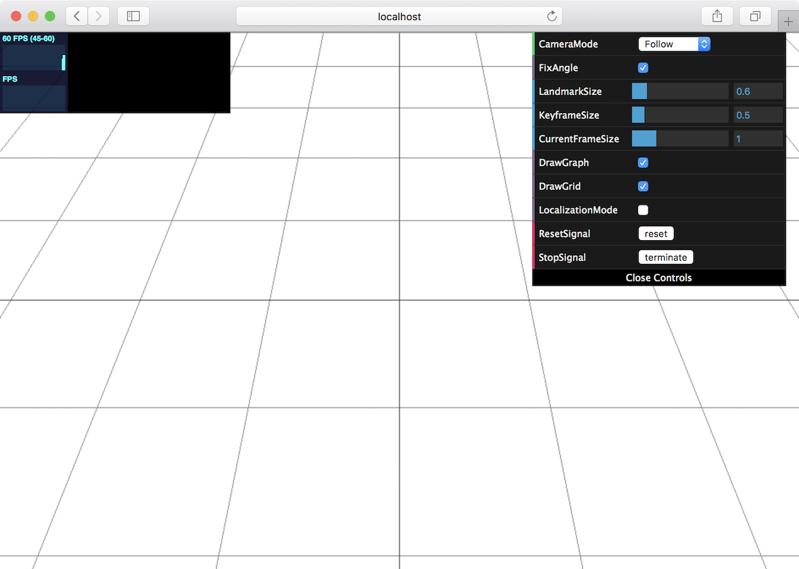

.. _chapter-installation:

============
Installation
============

.. _section-get-source:

Source code
===========

The source code can be viewed from this `GitHub repository <https://github.com/xdspacelab/openvslam>`_.

Cloning the repository:

.. code-block:: bash

       git clone https://github.com/xdspacelab/openvslam

If you are Windows 10 user, please install the dependencies and OpenVSLAM with :ref:`SocketViewer support <subsection-dependencies-socketviewer>` on `Windows Subsystem for Linux (WSL) <https://en.wikipedia.org/wiki/Windows_Subsystem_for_Linux>`__.
We have checked the correct operation of OpenVSLAM and SocketViewer on Ubuntu 16.04 running on WSL.

:ref:`Docker <chapter-docker>` systems can be used instead of preparing the dependencies manually.

.. _section-dependencies:

Dependencies
============

OpenVSLAM requires a **C++11-compliant** compiler.
It relies on several open-source libraries as shown below.

Requirements for OpenVSLAM
^^^^^^^^^^^^^^^^^^^^^^^^^^

* `Eigen <http://eigen.tuxfamily.org/>`_ : version 3.3.0 or later.

* `g2o <https://github.com/RainerKuemmerle/g2o>`_ : Please use the latest release. Tested on commit ID `9b41a4e <https://github.com/RainerKuemmerle/g2o/tree/9b41a4ea5ade8e1250b9c1b279f3a9c098811b5a>`_.

* `SuiteSparse <http://faculty.cse.tamu.edu/davis/suitesparse.html>`_ : Required by g2o.

* `DBoW2 <https://github.com/shinsumicco/DBoW2>`_ : **Please use the custom version of DBoW2** released in `https://github.com/shinsumicco/DBoW2 <https://github.com/shinsumicco/DBoW2>`_.

* `yaml-cpp <https://github.com/jbeder/yaml-cpp>`_ : version 0.6.0 or later.

* `OpenCV <https://opencv.org/>`_ : version 3.3.1 or later.

.. NOTE ::

    OpenCV with GUI support is necessary for using the built-in viewer (Pangolin Viewer).

.. NOTE ::

    OpenCV with video support is necessary if you plan on using video files (e.g. ``.mp4``) as inputs.

Requirements for PangolinViewer
^^^^^^^^^^^^^^^^^^^^^^^^^^^^^^^^

| We provided an OpenGL-based simple viewer.
| This viewer is implemented with `Pangolin <https://github.com/stevenlovegrove/Pangolin>`_. Thus, we call it **PangolinViewer**.
| Please install the following dependencies if you plan on using PangolinViewer.

* `Pangolin <https://github.com/stevenlovegrove/Pangolin>`_ : Please use the latest release. Tested on commit ID `ad8b5f8 <https://github.com/stevenlovegrove/Pangolin/tree/ad8b5f83222291c51b4800d5a5873b0e90a0cf81>`_.

* `GLEW <http://glew.sourceforge.net/>`_ : Required by Pangolin.

.. _subsection-dependencies-socketviewer:

Requirements for SocketViewer
^^^^^^^^^^^^^^^^^^^^^^^^^^^^^^^^^

| We provided an WebGL-based simple viewer running on web browsers.
| The SLAM systems publish the map and the frame to the server implemented with `Node.js <https://nodejs.org/>`_ via WebSocket. Thus, we call it **SocketViewer**.
| Please install the following dependencies if you plan on using SocketViewer.

* `socket.io-client-cpp <https://github.com/shinsumicco/socket.io-client-cpp>`_ : **Please use the custom version of socket.io-client-cpp** released in `https://github.com/shinsumicco/socket.io-client-cpp <https://github.com/shinsumicco/socket.io-client-cpp>`_.

* `Protobuf <https://github.com/protocolbuffers/protobuf>`_ : version 3 or later.

The following libraries are the dependencies for the server.

* `Node.js <https://nodejs.org/>`_ : version 6 or later.

* `npm <https://www.npmjs.com/>`_ : Tested on version 3.5.2.

Recommended
^^^^^^^^^^^

* `google-glog <https://github.com/google/glog>`_ : Used for stack-trace logger.

.. _section-prerequisites-unix:

Prerequisites for Unix
======================

.. NOTE ::

    In the following instruction, we assume that ``CMAKE_INSTALL_PREFIX`` is ``/usr/local``. If you want to install the libraries to the different location, set ``CMAKE_INSTALL_PREFIX`` to your environment and **set the environment variables accordingly**.

.. NOTE ::

    If your PC is frozen during the build, please reduce the number of parallel compile jobs when executing ``make`` (e.g. ``make -j2``).

.. _section-linux:

Installing for Linux
^^^^^^^^^^^^^^^^^^^^

Tested for **Ubuntu 16.04**.

Install the dependencies via ``apt``.

.. code-block:: bash

    apt update -y
    apt upgrade -y --no-install-recommends
    # basic dependencies
    apt install -y build-essential pkg-config cmake git wget curl unzip
    # g2o dependencies
    apt install -y libatlas-base-dev libsuitesparse-dev
    # OpenCV dependencies
    apt install -y libgtk-3-dev
    apt install -y ffmpeg
    apt install -y libavcodec-dev libavformat-dev libavutil-dev libswscale-dev libavresample-dev
    # eigen dependencies
    apt install -y gfortran
    # other dependencies
    apt install -y libyaml-cpp-dev libgoogle-glog-dev libgflags-dev 

    # (if you plan on using PangolinViewer)
    # Pangolin dependencies
    apt install -y libglew-dev

    # (if you plan on using SocketViewer)
    # Protobuf dependencies
    apt install -y autogen autoconf libtool
    # Node.js
    curl -sL https://deb.nodesource.com/setup_12.x | sudo -E bash -
    apt install -y nodejs

Download and install Eigen from source.

.. code-block:: bash

    cd /path/to/working/dir
    wget -q https://gitlab.com/libeigen/eigen/-/archive/3.3.7/eigen-3.3.7.tar.bz2
    tar xf eigen-3.3.7.tar.bz2
    rm -rf eigen-3.3.7.tar.bz2
    cd eigen-3.3.7
    mkdir -p build && cd build
    cmake \
        -DCMAKE_BUILD_TYPE=Release \
        -DCMAKE_INSTALL_PREFIX=/usr/local \
        ..
    make -j4
    make install

Download, build and install OpenCV from source.

.. code-block:: bash

    cd /path/to/working/dir
    wget -q https://github.com/opencv/opencv/archive/3.4.0.zip
    unzip -q 3.4.0.zip
    rm -rf 3.4.0.zip
    cd opencv-3.4.0
    mkdir -p build && cd build
    cmake \
        -DCMAKE_BUILD_TYPE=Release \
        -DCMAKE_INSTALL_PREFIX=/usr/local \
        -DENABLE_CXX11=ON \
        -DBUILD_DOCS=OFF \
        -DBUILD_EXAMPLES=OFF \
        -DBUILD_JASPER=OFF \
        -DBUILD_OPENEXR=OFF \
        -DBUILD_PERF_TESTS=OFF \
        -DBUILD_TESTS=OFF \
        -DWITH_EIGEN=ON \
        -DWITH_FFMPEG=ON \
        -DWITH_OPENMP=ON \
        ..
    make -j4
    make install

Jump to :ref:`Common Installation Instructions <subsection-common-linux-macos>` for the next step.

.. _section-macos:

Installing for macOS
^^^^^^^^^^^^^^^^^^^^

Tested for **macOS High Sierra**.

Install the dependencies via ``brew``.

.. code-block:: bash

    brew update
    # basic dependencies
    brew install pkg-config cmake git
    # g2o dependencies
    brew install suite-sparse
    # OpenCV dependencies and OpenCV
    brew install eigen
    brew install ffmpeg
    brew install opencv
    # other dependencies
    brew install yaml-cpp glog gflags

    # (if you plan on using PangolinViewer)
    # Pangolin dependencies
    brew install glew

    # (if you plan on using SocketViewer)
    # Protobuf dependencies
    brew install automake autoconf libtool
    # Node.js
    brew install node

Jump to :ref:`Common Installation Instructions <subsection-common-linux-macos>` for the next step.

.. _subsection-common-linux-macos:

Common Installation Instructions
^^^^^^^^^^^^^^^^^^^^^^^^^^^^^^^^

Download, build and install **the custom DBoW2** from source.

.. code-block:: bash

    cd /path/to/working/dir
    git clone https://github.com/shinsumicco/DBoW2.git
    cd DBoW2
    mkdir build && cd build
    cmake \
        -DCMAKE_BUILD_TYPE=Release \
        -DCMAKE_INSTALL_PREFIX=/usr/local \
        ..
    make -j4
    make install

Download, build and install g2o.

.. code-block:: bash

    cd /path/to/working/dir
    git clone https://github.com/RainerKuemmerle/g2o.git
    cd g2o
    git checkout 9b41a4ea5ade8e1250b9c1b279f3a9c098811b5a
    mkdir build && cd build
    cmake \
        -DCMAKE_BUILD_TYPE=Release \
        -DCMAKE_INSTALL_PREFIX=/usr/local \
        -DCMAKE_CXX_FLAGS=-std=c++11 \
        -DBUILD_SHARED_LIBS=ON \
        -DBUILD_UNITTESTS=OFF \
        -DBUILD_WITH_MARCH_NATIVE=ON \
        -DG2O_USE_CHOLMOD=OFF \
        -DG2O_USE_CSPARSE=ON \
        -DG2O_USE_OPENGL=OFF \
        -DG2O_USE_OPENMP=ON \
        ..
    make -j4
    make install

| (**if you plan on using PangolinViewer**)
| Download, build and install Pangolin from source.

.. code-block:: bash

    cd /path/to/working/dir
    git clone https://github.com/stevenlovegrove/Pangolin.git
    cd Pangolin
    git checkout ad8b5f83222291c51b4800d5a5873b0e90a0cf81
    mkdir build && cd build
    cmake \
        -DCMAKE_BUILD_TYPE=Release \
        -DCMAKE_INSTALL_PREFIX=/usr/local \
        ..
    make -j4
    make install

| (**if you plan on using SocketViewer**)
| Download, build and install socket.io-client-cpp from source.

.. code-block:: bash

    cd /path/to/working/dir
    git clone https://github.com/shinsumicco/socket.io-client-cpp.git
    cd socket.io-client-cpp
    git submodule init
    git submodule update
    mkdir build && cd build
    cmake \
        -DCMAKE_BUILD_TYPE=Release \
        -DCMAKE_INSTALL_PREFIX=/usr/local \
        -DBUILD_UNIT_TESTS=OFF \
        ..
    make -j4
    make install

| (**if you plan on using SocketViewer**)
| Install Protobuf.

If you use Ubuntu 18.04 or macOS, Protobuf 3.x can be installed via ``apt`` or ``brew``.

.. code-block:: bash

    # for Ubuntu 18.04 (or later)
    apt install -y libprotobuf-dev protobuf-compiler
    # for macOS
    brew install protobuf

Otherwise, please download, build and install Protobuf from source.

.. code-block:: bash

    wget -q https://github.com/google/protobuf/archive/v3.6.1.tar.gz
    tar xf v3.6.1.tar.gz
    cd protobuf-3.6.1
    ./autogen.sh
    ./configure \
        --prefix=/usr/local \
        --enable-static=no
    make -j4
    make install

.. _section-build-unix:

Build Instructions
==================

When building with support for PangolinViewer, please specify the following cmake options: ``-DUSE_PANGOLIN_VIEWER=ON`` and ``-DUSE_SOCKET_PUBLISHER=OFF``.

.. code-block:: bash

    cd /path/to/openvslam
    mkdir build && cd build
    cmake \
        -DBUILD_WITH_MARCH_NATIVE=ON \
        -DUSE_PANGOLIN_VIEWER=ON \
        -DUSE_SOCKET_PUBLISHER=OFF \
        -DUSE_STACK_TRACE_LOGGER=ON \
        -DBOW_FRAMEWORK=DBoW2 \
        -DBUILD_TESTS=ON \
        ..
    make -j4

When building with support for SocketViewer, please specify the following cmake options: ``-DUSE_PANGOLIN_VIEWER=OFF`` and ``-DUSE_SOCKET_PUBLISHER=ON``.

.. code-block:: bash

    cd /path/to/openvslam
    mkdir build && cd build
    cmake \
        -DBUILD_WITH_MARCH_NATIVE=ON \
        -DUSE_PANGOLIN_VIEWER=OFF \
        -DUSE_SOCKET_PUBLISHER=ON \
        -DUSE_STACK_TRACE_LOGGER=ON \
        -DBOW_FRAMEWORK=DBoW2 \
        -DBUILD_TESTS=ON \
        ..
    make -j4

.. NOTE ::

    If ``cmake`` cannot find any dependencies, set the environment variables directly.
    For example, when ``CMAKE_INSTALL_PREFIX`` is ``/usr/local``:

    - ``Eigen3_DIR=/usr/local/share/eigen3/cmake``
    - ``OpenCV_DIR=/usr/local/share/OpenCV``
    - ``DBoW2_DIR=/usr/local/lib/cmake/DBoW2``
    - ``g2o_DIR=/usr/local/lib/cmake/g2o``
    - ``Pangolin_DIR=/usr/local/lib/cmake/Pangolin`` (if installed)
    - ``sioclient_DIR=/usr/local/lib/cmake/sioclient`` (if installed)

After building, check to see if it was successfully built by executing ``./run_kitti_slam -h``.

.. code-block:: bash

    $ ./run_kitti_slam -h
    Allowed options:
    -h, --help             produce help message
    -v, --vocab arg        vocabulary file path
    -d, --data-dir arg     directory path which contains dataset
    -c, --config arg       config file path
    --frame-skip arg (=1)  interval of frame skip
    --no-sleep             not wait for next frame in real time
    --auto-term            automatically terminate the viewer
    --debug                debug mode
    --eval-log             store trajectory and tracking times for evaluation
    -p, --map-db arg       store a map database at this path after SLAM

.. NOTE ::

    If OpenVSLAM terminates abnormaly, rebuild g2o and OpenVSLAM with ``-DBUILD_WITH_MARCH_NATIVE=OFF`` option for ``cmake`` configulation.

.. _section-server-setup:

Server Setup for SocketViewer
=============================

If you plan on using SocketViewer, please setup the environment for the server with ``npm``.

.. code-block:: bash

    $ cd /path/to/openvslam/viewer
    $ ls
    Dockerfile  app.js  package.json  public  views
    $ npm install
    added 88 packages from 60 contributors and audited 204 packages in 2.105s
    found 0 vulnerabilities
    $ ls
    Dockerfile  app.js  node_modules  package-lock.json  package.json  public  views

Then, launch the server with ``node app.js``.

.. code-block:: bash

    $ cd /path/to/openvslam/viewer
    $ ls
    Dockerfile  app.js  node_modules  package-lock.json  package.json  public  views
    $ node app.js
    WebSocket: listening on *:3000
    HTTP server: listening on *:3001

After launching, please access to ``http://localhost:3001/`` to check whether the server is correctly launched.

.. NOTE ::

    When you try :ref:`the tutotial <chapter-simple-tutorial>` and :ref:`the examples <chapter-example>` with SocketViewer, please launch the server in the other terminal and access to it with the web browser **in advance**.
