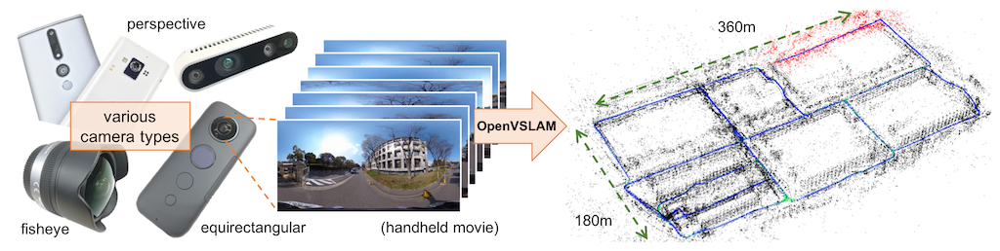

.. _chapter-overview:

========
Overview
========

.. image:: https://raw.githubusercontent.com/wiki/xdspacelab/openvslam/media/tracking.gif
    :width: 640px
    :align: center

OpenVSLAM is a monocular, stereo, and RGBD visual SLAM system.
The notable features are:

* It is compatible with **various type of camera models** and can be easily customized for other camera models.
* Created maps can be **stored and loaded**, then OpenVSLAM can **localize new images** based on the prebuilt maps.
* The system is fully modular. It is designed by encapsulating several functions in separated components with easy-to-understand APIs.
* We provided **some code snippets** to understand the core functionalities of this system.

OpenVSLAM is based on an indirect SLAM algorithm with sparse features, such as ORB-SLAM, ProSLAM, and UcoSLAM.
One of the noteworthy features of OpenVSLAM is that the system can deal with various type of camera models, such as perspective, fisheye, and equirectangular.
If needed, users can implement extra camera models (e.g. dual fisheye, catadioptric) with ease.
For example, visual SLAM algorithm using **equirectangular camera models** (e.g. RICOH THETA series, insta360 series, etc) is shown above.

Some code snippets to understand the core functionalities of the system are provided.
You can employ these snippets for in your own programs.
Please see the ``*.cc`` files in ``./example`` directory or check  :ref:`Simple Tutorial <chapter-simple-tutorial>` and :ref:`Example <chapter-example>`.

Also, some examples to run OpenVSLAM on ROS framework are provided.
Please check :ref:`ROS Package <chapter-ros-package>`.

Please contact us via `GitHub issues <https://github.com/xdspacelab/openvslam/issues>`__ if you have any questions or notice any bugs about the software.

.. _section-overview-installation:

Installation
^^^^^^^^^^^^

Please see :ref:`Installation <chapter-installation>` chapter.

:ref:`The instructions for Docker users <chapter-docker>` are also provided.

.. _section-overview-tutorial:

Tutorial
^^^^^^^^

Please see :ref:`Simple Tutorial <chapter-simple-tutorial>`.

| A sample ORB vocabulary file can be downloaded from `here <https://drive.google.com/open?id=1wUPb328th8bUqhOk-i8xllt5mgRW4n84>`__.
| Sample datasets are also provided at `here <https://drive.google.com/open?id=1A_gq8LYuENePhNHsuscLZQPhbJJwzAq4>`__. 

If you would like to run visual SLAM with standard benchmarking datasets (e.g. KITTI Odometry dataset), please see :ref:`SLAM with standard datasets <section-example-standard-datasets>`.

.. _section-overview-reference:

Reference
^^^^^^^^^

- Raúl Mur-Artal, J. M. M. Montiel, and Juan D. Tardós. 2015. ORB-SLAM: a Versatile and Accurate Monocular SLAM System. IEEE Transactions on Robotics 31, 5 (2015), 1147–1163.
- Raúl Mur-Artal and Juan D. Tardós. 2017. ORB-SLAM2: an Open-Source SLAM System for Monocular, Stereo and RGB-D Cameras. IEEE Transactions on Robotics 33, 5 (2017), 1255–1262.
- Dominik Schlegel, Mirco Colosi, and Giorgio Grisetti. 2018. ProSLAM: Graph SLAM from a Programmer’s Perspective. In Proceedings of IEEE International Conference on Robotics and Automation (ICRA). 1–9.
- Rafael Muñoz-Salinas and Rafael Medina Carnicer. 2019. UcoSLAM: Simultaneous Localization and Mapping by Fusion of KeyPoints and Squared Planar Markers. arXiv:1902.03729.
- Mapillary AB. 2019. OpenSfM. `https://github.com/mapillary/OpenSfM <https://github.com/mapillary/OpenSfM>`_.
- Giorgio Grisetti, Rainer Kümmerle, Cyrill Stachniss, and Wolfram Burgard. 2010. A Tutorial on Graph-Based SLAM. IEEE Transactions on Intelligent Transportation SystemsMagazine 2, 4 (2010), 31–43.
- Rainer Kümmerle, Giorgio Grisetti, Hauke Strasdat, Kurt Konolige, and Wolfram Burgard. 2011. g2o: A general framework for graph optimization. In Proceedings of IEEE International Conference on Robotics and Automation (ICRA). 3607–3613.
