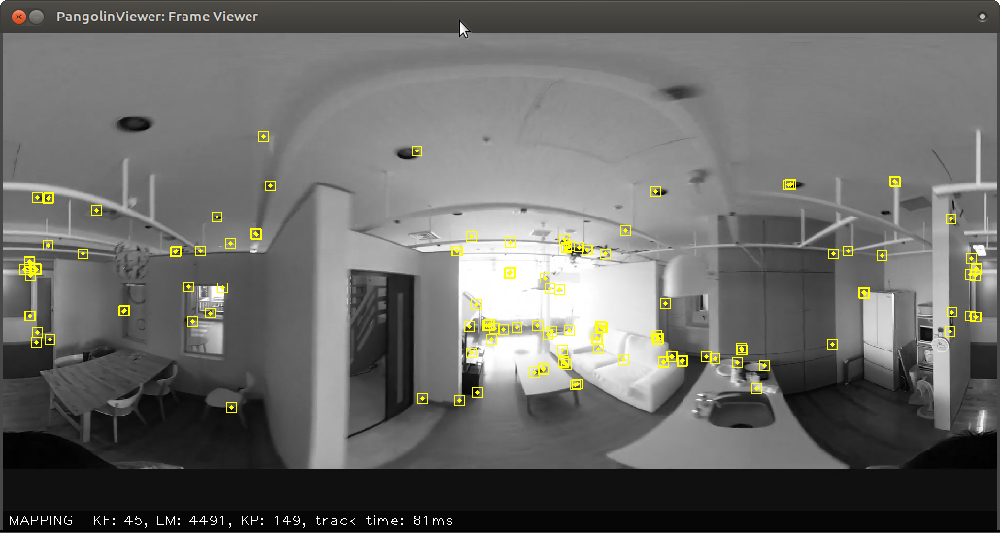
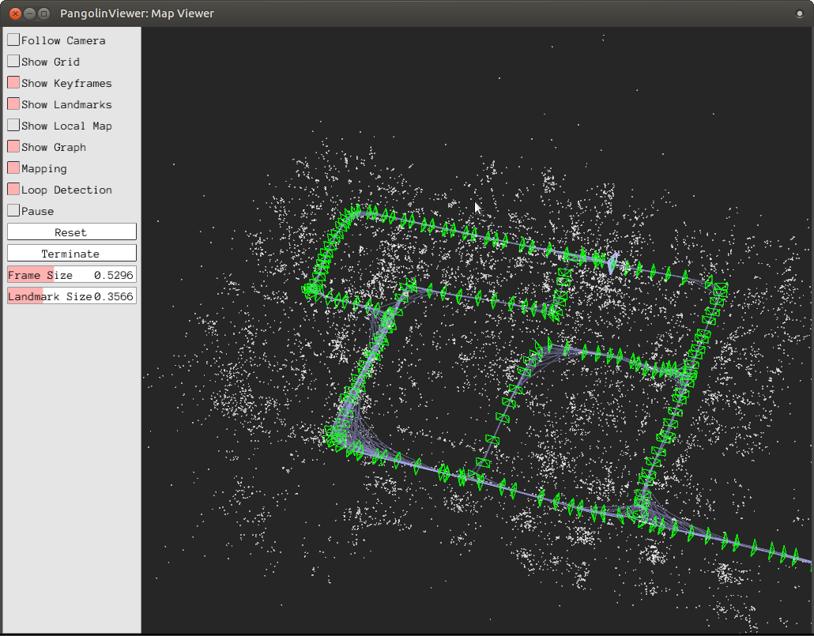
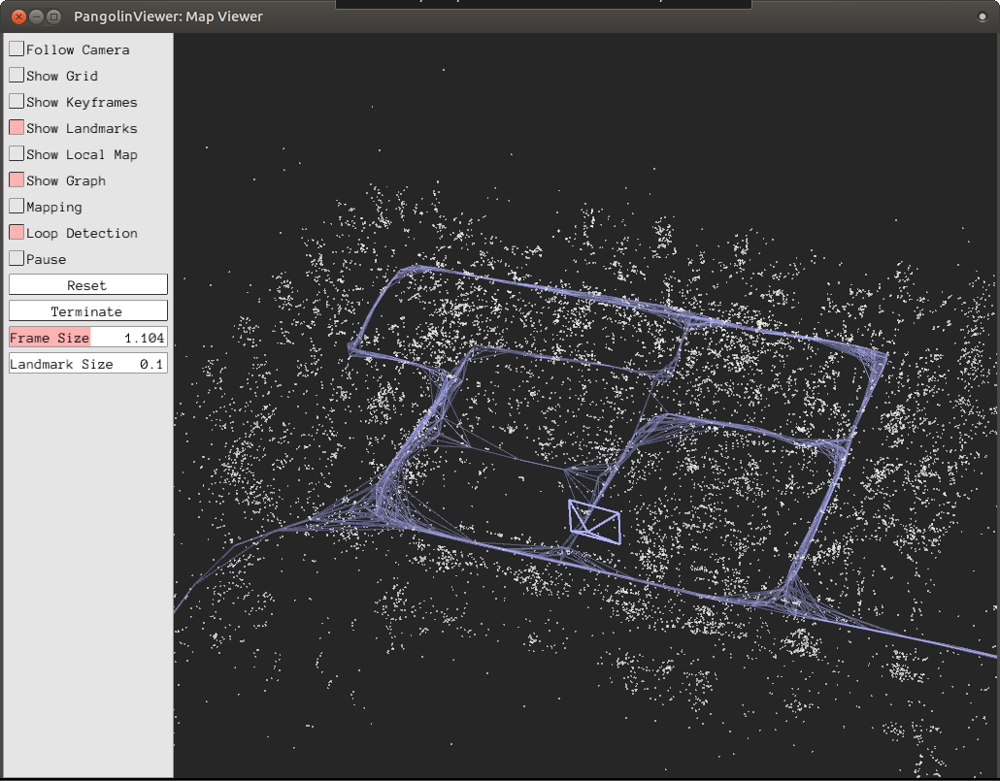

.. _chapter-simple-tutorial:

===============
Simple Tutorial
===============

TL; DR
^^^^^^

.. NOTE ::

  If you use :ref:`SocketViewer <subsection-dependencies-socketviewer>`, please launch the server in the other terminal and access to it with the web browser **in advance**.

Running the following commands will give a feel for what OpenVSLAM can do.
The later parts of this chapter explains what each of the commands do in more detail.

.. code-block:: bash

    # at the build directory of openvslam ...
    $ pwd
    /path/to/openvslam/build/
    $ ls
    run_video_slam   run_video_localization   lib/   ...

    # download an ORB vocabulary from Google Drive
    FILE_ID="1wUPb328th8bUqhOk-i8xllt5mgRW4n84"
    curl -sc /tmp/cookie "https://drive.google.com/uc?export=download&id=${FILE_ID}" > /dev/null
    CODE="$(awk '/_warning_/ {print $NF}' /tmp/cookie)"
    curl -sLb /tmp/cookie "https://drive.google.com/uc?export=download&confirm=${CODE}&id=${FILE_ID}" -o orb_vocab.zip
    unzip orb_vocab.zip

    # download a sample dataset from Google Drive
    FILE_ID="1d8kADKWBptEqTF7jEVhKatBEdN7g0ikY"
    curl -sc /tmp/cookie "https://drive.google.com/uc?export=download&id=${FILE_ID}" > /dev/null
    CODE="$(awk '/_warning_/ {print $NF}' /tmp/cookie)"
    curl -sLb /tmp/cookie "https://drive.google.com/uc?export=download&confirm=${CODE}&id=${FILE_ID}" -o aist_living_lab_1.zip
    unzip aist_living_lab_1.zip

    # download a sample dataset from Google Drive
    FILE_ID="1TVf2D2QvMZPHsFoTb7HNxbXclPoFMGLX"
    curl -sc /tmp/cookie "https://drive.google.com/uc?export=download&id=${FILE_ID}" > /dev/null
    CODE="$(awk '/_warning_/ {print $NF}' /tmp/cookie)"
    curl -sLb /tmp/cookie "https://drive.google.com/uc?export=download&confirm=${CODE}&id=${FILE_ID}" -o aist_living_lab_2.zip
    unzip aist_living_lab_2.zip

    # run tracking and mapping
    ./run_video_slam -v ./orb_vocab/orb_vocab.dbow2 -m ./aist_living_lab_1/video.mp4 -c ./aist_living_lab_1/config.yaml --frame-skip 3 --no-sleep --map-db map.msg
    # click the [Terminate] button to close the viewer
    # you can find map.msg in the current directory

    # run localization
    ./run_video_localization -v ./orb_vocab/orb_vocab.dbow2 -m ./aist_living_lab_2/video.mp4 -c ./aist_living_lab_2/config.yaml --frame-skip 3 --no-sleep --map-db map.msg


Sample Datasets
^^^^^^^^^^^^^^^

You can use OpenVSLAM with various video datasets.
If you want to run OpenVSLAM with standard benchmarking detasets, please see :ref:`this section <section-example-standard-datasets>`.

Start by downloading some datasets you like.

Equirectangular Datasets
````````````````````````

.. list-table::
    :header-rows: 1
    :widths: 8, 8, 2, 7, 7

    * - name
      - camera model
      - length
      - Google Drive
      - Baidu Wangpan
    * - aist_entrance_hall_1
      - equirectangular (mono)
      - 0:54
      - `link <https://drive.google.com/open?id=1A_gq8LYuENePhNHsuscLZQPhbJJwzAq4>`__
      - `link <https://pan.baidu.com/s/1RTQJXFib96MaWe3NgWjW-Q>`__ (Pass: r7r4)
    * - aist_entrance_hall_2
      - equirectangular (mono)
      - 0:54
      - `link <https://drive.google.com/open?id=1A_gq8LYuENePhNHsuscLZQPhbJJwzAq4>`__
      - `link <https://pan.baidu.com/s/1RUDh1Gy9BMWlwZY4MnlW4w>`__ (Pass: 4qma)
    * - aist_factory_A_1
      - equirectangular (mono)
      - 1:55
      - `link <https://drive.google.com/open?id=1A_gq8LYuENePhNHsuscLZQPhbJJwzAq4>`__
      - `link <https://pan.baidu.com/s/1N4BxEj086RrToY2OA1iJvg>`__ (Pass: yy2u)
    * - aist_factory_A_2
      - equirectangular (mono)
      - 1:54
      - `link <https://drive.google.com/open?id=1A_gq8LYuENePhNHsuscLZQPhbJJwzAq4>`__
      - `link <https://pan.baidu.com/s/10HlYWYNX2J9oRVDpmT6SnA>`__ (Pass: 9vey)
    * - aist_factory_B_1
      - equirectangular (mono)
      - 1:04
      - `link <https://drive.google.com/open?id=1A_gq8LYuENePhNHsuscLZQPhbJJwzAq4>`__
      - `link <https://pan.baidu.com/s/1rVSem2pD-kILX5cEvucyFg>`__ (Pass: gpec)
    * - aist_factory_B_2
      - equirectangular (mono)
      - 1:34
      - `link <https://drive.google.com/open?id=1A_gq8LYuENePhNHsuscLZQPhbJJwzAq4>`__
      - `link <https://pan.baidu.com/s/1NSnDiof3-4zp6JX0dUDFUQ>`__ (Pass: ugrx)
    * - aist_living_lab_1
      - equirectangular (mono)
      - 2:16
      - `link <https://drive.google.com/open?id=1A_gq8LYuENePhNHsuscLZQPhbJJwzAq4>`__
      - `link <https://pan.baidu.com/s/1HtFP1czDz2rWQpvvX2ywpQ>`__ (Pass: 434m)
    * - aist_living_lab_2
      - equirectangular (mono)
      - 1:47
      - `link <https://drive.google.com/open?id=1A_gq8LYuENePhNHsuscLZQPhbJJwzAq4>`__
      - `link <https://pan.baidu.com/s/1NFP9owNKwLaeVl08R3UAnA>`__ (Pass: 549f)
    * - aist_living_lab_3
      - equirectangular (mono)
      - 2:06
      - `link <https://drive.google.com/open?id=1A_gq8LYuENePhNHsuscLZQPhbJJwzAq4>`__
      - `link <https://pan.baidu.com/s/13ORfLxbOUvX1CwK0pHCv4g>`__ (Pass: cc2p)
    * - aist_stairs_A_1
      - equirectangular (mono)
      - 2:27
      - `link <https://drive.google.com/open?id=1A_gq8LYuENePhNHsuscLZQPhbJJwzAq4>`__
      - `link <https://pan.baidu.com/s/1ECTjzGHxjygVUI4YoGNpww>`__ (Pass: ncdr)
    * - aist_stairs_B_1
      - equirectangular (mono)
      - 2:55
      - `link <https://drive.google.com/open?id=1A_gq8LYuENePhNHsuscLZQPhbJJwzAq4>`__
      - `link <https://pan.baidu.com/s/1m2ofFc9KhSSy7iWY0OjitQ>`__ (Pass: xr5t)
    * - aist_store_1
      - equirectangular (mono)
      - 1:12
      - `link <https://drive.google.com/open?id=1A_gq8LYuENePhNHsuscLZQPhbJJwzAq4>`__
      - `link <https://pan.baidu.com/s/1NxdGty8KVOZg9gJqafDw8A>`__ (Pass: 47vq)
    * - aist_store_2
      - equirectangular (mono)
      - 1:44
      - `link <https://drive.google.com/open?id=1A_gq8LYuENePhNHsuscLZQPhbJJwzAq4>`__
      - `link <https://pan.baidu.com/s/1QPWw45AfavtuzsyNNREioQ>`__ (Pass: xt8u)
    * - aist_store_3
      - equirectangular (mono)
      - 1:18
      - `link <https://drive.google.com/open?id=1A_gq8LYuENePhNHsuscLZQPhbJJwzAq4>`__
      - `link <https://pan.baidu.com/s/1a43ykBO2ObIle8S7FmvO0Q>`__ (Pass: kghc)
    * - ALL
      - equirectangular (mono)
      - 
      - `link <https://drive.google.com/open?id=1A_gq8LYuENePhNHsuscLZQPhbJJwzAq4>`__
      - `link <https://pan.baidu.com/s/1a6BCfQKpwhzlevZx1VkSZw>`__ (Pass: vsv7)

Fisheye Datasets
````````````````

.. list-table::
    :header-rows: 1
    :widths: 8, 8, 2, 7, 7

    * - name
      - camera model
      - length
      - Google Drive
      - Baidu Wangpan
    * - aist_entrance_hall_1
      - fisheye (mono)
      - 1:05
      - `link <https://drive.google.com/open?id=1SVDsgz-ydm1pAbrdmhRQTmWhJnUl_xr8>`__
      - `link <https://pan.baidu.com/s/1u7DtI1y9j5BhneL_UlFViQ>`__ (Pass: u86e)
    * - aist_entrance_hall_2
      - fisheye (mono)
      - 1:06
      - `link <https://drive.google.com/open?id=1SVDsgz-ydm1pAbrdmhRQTmWhJnUl_xr8>`__
      - `link <https://pan.baidu.com/s/1-uIgqvpYqwrKFWF_qkPVYg>`__ (Pass: 9iyc)
    * - aist_entrance_hall_3
      - fisheye (mono)
      - 1:23
      - `link <https://drive.google.com/open?id=1SVDsgz-ydm1pAbrdmhRQTmWhJnUl_xr8>`__
      - `link <https://pan.baidu.com/s/1LphrOShoLCYef2bDGT-IRA>`__ (Pass: qaqc)
    * - aist_entrance_hall_4
      - fisheye (mono)
      - 1:27
      - `link <https://drive.google.com/open?id=1SVDsgz-ydm1pAbrdmhRQTmWhJnUl_xr8>`__
      - `link <https://pan.baidu.com/s/1ftfIoa1ouN0vCukFYr51yg>`__ (Pass: em43)
    * - aist_living_lab_1
      - fisheye (mono)
      - 1:20
      - `link <https://drive.google.com/open?id=1SVDsgz-ydm1pAbrdmhRQTmWhJnUl_xr8>`__
      - `link <https://pan.baidu.com/s/10sr2HpL2AXnVdZZPybKNkA>`__ (Pass: wcw4)
    * - aist_living_lab_2
      - fisheye (mono)
      - 2:26
      - `link <https://drive.google.com/open?id=1SVDsgz-ydm1pAbrdmhRQTmWhJnUl_xr8>`__
      - `link <https://pan.baidu.com/s/11bse95I7IFAUB29N8i-jNw>`__ (Pass: dxns)
    * - aist_living_lab_3
      - fisheye (mono)
      - 3:43
      - `link <https://drive.google.com/open?id=1SVDsgz-ydm1pAbrdmhRQTmWhJnUl_xr8>`__
      - `link <https://pan.baidu.com/s/1M-UwqCOpSAETrcFxYaDnXg>`__ (Pass: 7n4q)
    * - nu_eng2_corridor_1
      - fisheye (mono)
      - 2:56
      - `link <https://drive.google.com/open?id=1SVDsgz-ydm1pAbrdmhRQTmWhJnUl_xr8>`__
      - `link <https://pan.baidu.com/s/1ztjXhXCM7GSSTmFd6d95rw>`__ (Pass: 71ws)
    * - nu_eng2_corridor_2
      - fisheye (mono)
      - 2:45
      - `link <https://drive.google.com/open?id=1SVDsgz-ydm1pAbrdmhRQTmWhJnUl_xr8>`__
      - `link <https://pan.baidu.com/s/1j4IAPuux3dzE5W7fM6o7Pw>`__ (Pass: yrtj)
    * - nu_eng2_corridor_3
      - fisheye (mono)
      - 2:04
      - `link <https://drive.google.com/open?id=1SVDsgz-ydm1pAbrdmhRQTmWhJnUl_xr8>`__
      - `link <https://pan.baidu.com/s/1cYEXzwYdr4YAjI6E_4B6wA>`__ (Pass: btpj)
    * - ALL
      - fisheye (mono)
      - 
      - `link <https://drive.google.com/open?id=1SVDsgz-ydm1pAbrdmhRQTmWhJnUl_xr8>`__
      - `link <https://pan.baidu.com/s/11gqp2t-A2kHRntyN8ueqSQ>`__ (Pass: gumj)


After downloading and uncompressing a zip file, you will find a video file and a config file under the uncompressed directory.


.. code-block:: bash

    $ ls dataset_name_X/
    config.yaml  video.mp4


You can put the dataset in any directory where you have access to.

| Additionally, please download a vocabulary file for DBoW2 from `Google Drive <https://drive.google.com/open?id=1wUPb328th8bUqhOk-i8xllt5mgRW4n84>`__ or `Baudu Wangpan <https://pan.baidu.com/s/1627YS4b-DC_0Ioya3gLTPQ>`__ (Pass: zb6v).
| After uncompressing it, you will find ``orb_vocab.dbow2``.

For the rest of this chapter, we will use ``aist_living_lab_1`` and ``aist_living_lab_2`` datasets for our example.


Tracking and Mapping
^^^^^^^^^^^^^^^^^^^^

Here we should know how to run SLAM and create a map database file with ``aist_living_lab_1`` dataset.
You can use ``./run_video_slam`` to run SLAM with the video file.


.. code-block:: bash

    # at the build directory of OpenVSLAM
    $ ls
    ...
    run_video_slam
    ...
    $ ./run_video_slam -h
    Allowed options:
      -h, --help             produce help message
      -v, --vocab arg        vocabulary file path
      -m, --video arg        video file path
      -c, --config arg       config file path
      --mask arg             mask image path
      --frame-skip arg (=1)  interval of frame skip
      --no-sleep             not wait for next frame in real time
      --auto-term            automatically terminate the viewer
      --debug                debug mode
      --eval-log             store trajectory and tracking times for evaluation
      -p, --map-db arg       store a map database at this path after SLAM


Execute the following command to run SLAM.
The paths should be changed accordingly.


.. code-block:: bash

    $ ./run_video_slam \
        -v /path/to/orb_vocab/orb_vocab.dbow2 \
        -c /path/to/aist_living_lab_1/config.yaml \
        -m /path/to/aist_living_lab_1/video.mp4 \
        --frame-skip 3 \
        --map-db aist_living_lab_1_map.msg


The frame viewer and map viewer should launch as well.
If the two viewers are not launching correctly, check if you launched the command with the appropriate paths.


.. NOTE ::

    If OpenVSLAM terminates abnormaly soon after initialization, rebuild g2o and OpenVSLAM with ``-DBUILD_WITH_MARCH_NATIVE=OFF`` option for ``cmake`` configulation.








.. code-block:: none

    [2019-05-20 17:52:41.677] [I] config file loaded: /path/to/aist_living_lab_1/aist_living_lab_1/config.yaml
      ___               __   _____ _      _   __  __  
     / _ \ _ __  ___ _ _\ \ / / __| |    /_\ |  \/  | 
    | (_) | '_ \/ -_) ' \\ V /\__ \ |__ / _ \| |\/| | 
     \___/| .__/\___|_||_|\_/ |___/____/_/ \_\_|  |_| 
          |_|                                         

    Copyright (C) 2019,
    National Institute of Advanced Industrial Science and Technology (AIST)
    All rights reserved.

    This is free software,
    and you are welcome to redistribute it under certain conditions.
    See the LICENSE file.

    Camera Configuration:
    - name: RICOH THETA S 960
    - setup: Monocular
    - fps: 30
    - cols: 1920
    - rows: 960
    - color: RGB
    - model: Equirectangular
    ORB Configuration:
    - number of keypoints: 2000
    - scale factor: 1.2
    - number of levels: 8
    - initial fast threshold: 20
    - minimum fast threshold: 7
    - edge threshold: 19
    - patch size: 31
    - half patch size: 15
    - mask rectangles:
      - [0, 1, 0, 0.1]
      - [0, 1, 0.84, 1]
      - [0, 0.2, 0.7, 1]
      - [0.8, 1, 0.7, 1]
    Tracking Configuration:

    [2019-05-20 17:52:41.678] [I] loading ORB vocabulary: /path/to/orb_vocab/orb_vocab.dbow2
    [2019-05-20 17:52:42.037] [I] startup SLAM system
    [2019-05-20 17:52:42.038] [I] start local mapper
    [2019-05-20 17:52:42.038] [I] start loop closer
    [2019-05-20 17:52:42.395] [I] initialization succeeded with E
    [2019-05-20 17:52:42.424] [I] new map created with 191 points: frame 0 - frame 2
    [2019-05-20 17:53:39.092] [I] detect loop: keyframe 36 - keyframe 139
    [2019-05-20 17:53:39.094] [I] pause local mapper
    [2019-05-20 17:53:39.303] [I] resume local mapper
    [2019-05-20 17:53:39.303] [I] start loop bundle adjustment
    [2019-05-20 17:53:40.186] [I] finish loop bundle adjustment
    [2019-05-20 17:53:40.186] [I] updating map with pose propagation
    [2019-05-20 17:53:40.194] [I] pause local mapper
    [2019-05-20 17:53:40.199] [I] resume local mapper
    [2019-05-20 17:53:40.199] [I] updated map
    [2019-05-20 17:55:36.218] [I] shutdown SLAM system
    [2019-05-20 17:55:36.218] [I] encoding 1 camera(s) to store
    [2019-05-20 17:55:36.218] [I] encoding 301 keyframes to store
    [2019-05-20 17:55:37.906] [I] encoding 19900 landmarks to store
    [2019-05-20 17:55:38.819] [I] save the MessagePack file of database to aist_living_lab_1_map.msg
    median tracking time: 0.045391[s]
    mean tracking time: 0.0472221[s]
    [2019-05-20 17:55:40.087] [I] clear BoW database
    [2019-05-20 17:55:40.284] [I] clear map database


Please click the **Terminate** button to close the viewer.

After terminating, you will find a map database file ``aist_living_lab_1_map.msg``.


.. code-block:: bash

    $ ls
    ...
    aist_living_lab_1_map.msg
    ...


The format of map database files is `MessagePack <https://msgpack.org/>`_, so you can reuse created maps for any third-party applications other than OpenVSLAM.


Localization
^^^^^^^^^^^^

In this section, we will localize the frames in ``aist_living_lab_2`` dataset using the created map file ``aist_living_lab_1_map.msg``.
You can use ``./run_video_localization`` to run localization.


.. code-block:: bash

    $ ./run_video_localization -h
    Allowed options:
      -h, --help             produce help message
      -v, --vocab arg        vocabulary file path
      -m, --video arg        video file path
      -c, --config arg       config file path
      -p, --map-db arg       path to a prebuilt map database
      --mapping              perform mapping as well as localization
      --mask arg             mask image path
      --frame-skip arg (=1)  interval of frame skip
      --no-sleep             not wait for next frame in real time
      --auto-term            automatically terminate the viewer
      --debug                debug mode


Execute the following command to start localization.
The paths should be changed accordingly.


.. code-block:: bash

    $ ./run_video_localization \
        -v /path/to/orb_vocab/orb_vocab.dbow2 \
        -c /path/to/aist_living_lab_2/config.yaml \
        -m /path/to/aist_living_lab_2/video.mp4 \
        --frame-skip 3 \
        --map-db aist_living_lab_1_map.msg


The frame viewer and map viewer should launch as well.
If the two viewers are not launching correctly, check if you launched the command with the appropriate paths.


You can see if the current frame is being localized, based on the prebuild map.





.. code-block:: none

    [2019-05-20 17:58:54.728] [I] config file loaded: /path/to/aist_living_lab_2/config.yaml
      ___               __   _____ _      _   __  __  
     / _ \ _ __  ___ _ _\ \ / / __| |    /_\ |  \/  | 
    | (_) | '_ \/ -_) ' \\ V /\__ \ |__ / _ \| |\/| | 
     \___/| .__/\___|_||_|\_/ |___/____/_/ \_\_|  |_| 
          |_|                                         

    Copyright (C) 2019,
    National Institute of Advanced Industrial Science and Technology (AIST)
    All rights reserved.

    This is free software,
    and you are welcome to redistribute it under certain conditions.
    See the LICENSE file.

    Camera Configuration:
    - name: RICOH THETA S 960
    - setup: Monocular
    - fps: 30
    - cols: 1920
    - rows: 960
    - color: RGB
    - model: Equirectangular
    ORB Configuration:
    - number of keypoints: 2000
    - scale factor: 1.2
    - number of levels: 8
    - initial fast threshold: 20
    - minimum fast threshold: 7
    - edge threshold: 19
    - patch size: 31
    - half patch size: 15
    - mask rectangles:
      - [0, 1, 0, 0.1]
      - [0, 1, 0.84, 1]
      - [0, 0.2, 0.7, 1]
      - [0.8, 1, 0.7, 1]
    Tracking Configuration:

    [2019-05-20 17:58:54.729] [I] loading ORB vocabulary: /path/to/orb_vocab/orb_vocab.dbow2
    [2019-05-20 17:58:55.083] [I] clear map database
    [2019-05-20 17:58:55.083] [I] clear BoW database
    [2019-05-20 17:58:55.083] [I] load the MessagePack file of database from aist_living_lab_1_map.msg
    [2019-05-20 17:58:57.832] [I] decoding 1 camera(s) to load
    [2019-05-20 17:58:57.832] [I] load the tracking camera "RICOH THETA S 960" from JSON
    [2019-05-20 17:58:58.204] [I] decoding 301 keyframes to load
    [2019-05-20 17:59:02.013] [I] decoding 19900 landmarks to load
    [2019-05-20 17:59:02.036] [I] registering essential graph
    [2019-05-20 17:59:02.564] [I] registering keyframe-landmark association
    [2019-05-20 17:59:03.161] [I] updating covisibility graph
    [2019-05-20 17:59:03.341] [I] updating landmark geometry
    [2019-05-20 17:59:04.189] [I] startup SLAM system
    [2019-05-20 17:59:04.190] [I] start local mapper
    [2019-05-20 17:59:04.191] [I] start loop closer
    [2019-05-20 17:59:04.195] [I] pause local mapper
    [2019-05-20 17:59:04.424] [I] relocalization succeeded
    [2019-05-20 18:01:12.387] [I] shutdown SLAM system
    median tracking time: 0.0370831[s]
    mean tracking time: 0.0384683[s]
    [2019-05-20 18:01:12.390] [I] clear BoW database
    [2019-05-20 18:01:12.574] [I] clear map database


If you set the ``--mapping`` option, the mapping module is enabled to extend the prebuild map.
